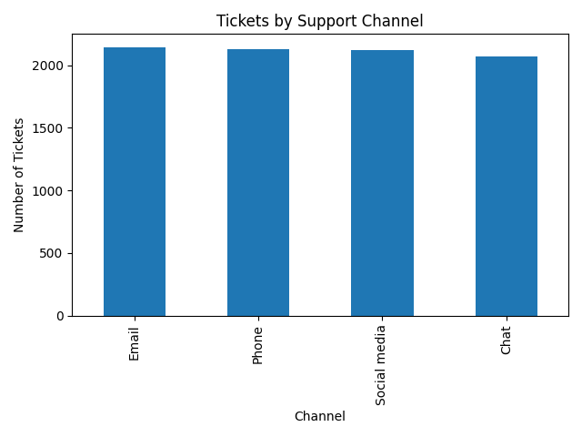

📊 **Customer Support Ticket Analytics — SQL + Python**

This project analyses a customer support ticket dataset to understand patterns in ticket volume, customer satisfaction, and support performance across different communication channels.

The workflow includes turning raw CSV data into a SQLite database, running SQL queries for insights, and visualising results using Python.

🧰 **Tools & Technologies**
Category	Technology
Database	SQLite
Querying	SQL
Language	Python
Libraries	Pandas, Matplotlib
Environment	VS Code

📁 **Project Structure**

customer-support-ticket-analytics/
│
├── data/                           # Raw dataset

│   └── customer_support_tickets.csv
├── images/                         # Generated visual outputs

│   └── tickets_by_channel.png
├── src/
│   ├── setup_database.py           # Creates SQLite database from CSV

│   └── run_queries.py              # Runs SQL and visualizations
├── customer_support.db             # SQLite database file

└── README.md                       # Project documentation

🚀 **How to Run**

1️⃣ Install required libraries:
python -m pip install pandas matplotlib

2️⃣ Create the database:
python src/setup_database.py

3️⃣ Run analysis and generate visual output:
python src/run_queries.py

📈 **Example Output**

Tickets by Support Channel

🔍 **Insights**

Support channels receive varying volumes of requests.

Customer satisfaction and resolution time vary depending on the support method.

Insight into channel usage can guide resource allocation and workflow optimisation.

🧠 **Skills Demonstrated**

Data loading and cleaning

SQL querying and relational database design

Python data analysis

Visual storytelling with charts

Project structuring and documentation

Git/GitHub readiness

📌 **Future Improvements**

Add interactive dashboard (Streamlit, Tableau, or Power BI)

Build a prediction model (e.g., resolution time or satisfaction)

Add automated reporting pipeline

